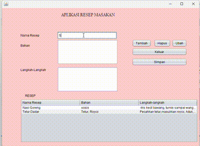

# Aplikasi Resep Masakan

Aplikasi Resep Masakan adalah aplikasi berbasis Java yang membantu pengguna mengelola daftar resep masakan. Dengan aplikasi ini, pengguna dapat menambahkan, mengedit, menghapus, serta menyimpan data resep ke file CSV. Aplikasi ini memanfaatkan database SQLite untuk menyimpan data resep secara permanen.

## Keunggulan Aplikasi

- **Pengelolaan Resep Masakan**: Menyediakan fitur untuk menambahkan, mengubah, dan menghapus resep masakan.
- **Simpan ke File CSV**: Ekspor data resep ke file CSV untuk keperluan arsip atau berbagi dengan pengguna lain.
- **Antarmuka Sederhana**: Dibangun dengan Java Swing, antarmuka aplikasi ini mudah digunakan oleh siapa saja.
- **Database Lokal**: Menggunakan SQLite untuk menyimpan data secara permanen.

## Pembuat Aplikasi

Salsa Alya Istiqamah - 2210010089 - UTS Aplikasi Resep Masakan

## Fitur

1. **Tambah Resep**
   - Pengguna dapat menambahkan resep baru dengan mengisi nama resep, bahan, dan langkah-langkah.

2. **Edit Resep**
   - Pengguna dapat memilih baris resep di tabel untuk mengubah informasi yang salah atau diperbarui.

3. **Hapus Resep**
   - Resep yang tidak lagi dibutuhkan dapat dihapus dengan mudah dari tabel dan database.

4. **Simpan ke CSV**
   - Data resep dapat diekspor ke file CSV untuk keperluan penyimpanan atau berbagi data.

5. **Database Lokal**
   - Semua data disimpan secara lokal di SQLite untuk memastikan data tetap tersimpan meskipun aplikasi ditutup.

## Cara Menjalankan

1. Clone repositori ini ke komputer Anda atau unduh sebagai file ZIP.
2. Pastikan JDK dan SQLite sudah terinstal di komputer Anda.
3. Buka proyek di IDE seperti NetBeans atau IntelliJ IDEA.
4. Jalankan file `Uts.java` untuk memulai aplikasi.

## Cara Penggunaan

1. **Menambahkan Resep**
   - Isi kolom "Nama Resep", "Bahan", dan "Langkah-langkah".
   - Klik tombol **Tambah** untuk menyimpan resep ke tabel dan database.

2. **Mengedit Resep**
   - Pilih baris resep dari tabel.
   - Ubah data di kolom input dan klik tombol **Ubah** untuk menyimpan perubahan.

3. **Menghapus Resep**
   - Pilih baris resep yang ingin dihapus dari tabel.
   - Klik tombol **Hapus** untuk menghapus resep dari tabel dan database.

4. **Ekspor ke CSV**
   - Klik tombol **Simpan** untuk mengekspor data resep ke file CSV.
   - Pilih lokasi penyimpanan file CSV melalui dialog file chooser.

5. **Keluar Aplikasi**
   - Klik tombol **Keluar** untuk menutup aplikasi
## Demo

## Catatan 

- Pastikan file `resep.db` dapat diakses oleh aplikasi. Jika file belum ada, aplikasi akan otomatis membuat database baru.
- Jika terjadi error, pastikan JDK dan SQLite sudah terinstal dengan benar di sistem Anda.

